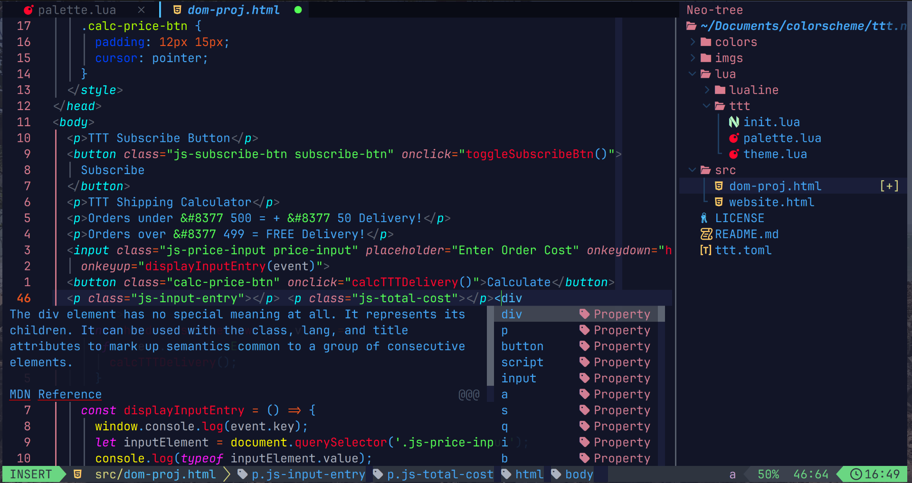
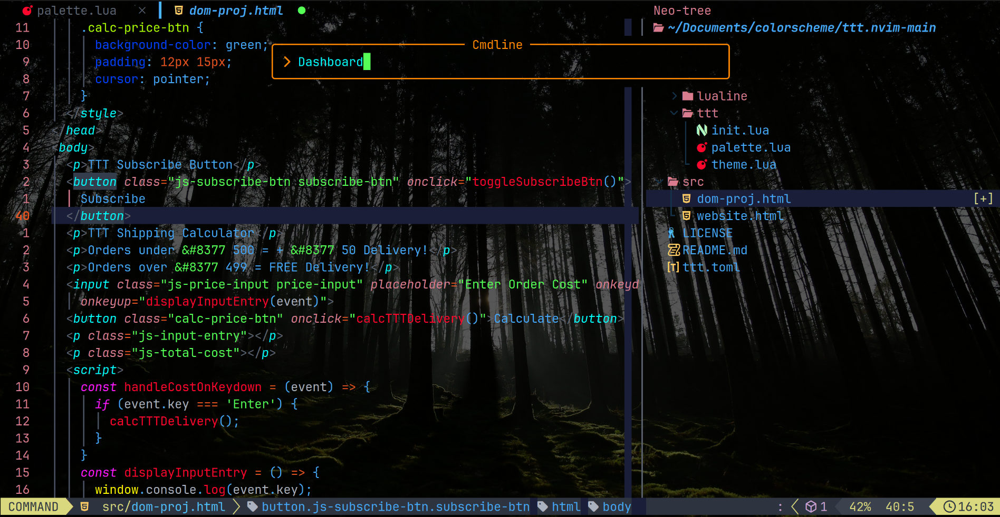

<p align="center">
    <h2 align="center"> TTT </h2>
</p>
<p align="center">
  Neovim color scheme for Dev!
</p>
<p>
    <h3 align="center">🎨 Lazy Install ..</h3>
</p>
  
```lua
return {
  "kireetshetty/ttt.nvim",
  lazy = false,
  priority = 999,
  config = function()
    vim.cmd([[colorscheme ttt]])
  end,
}
```
<p align="center">
    ~
</p>
<p align="center">
  Default color scheme with dark background!
</p>
<p align="center">
    
</p>
<p align="center">
    ~
</p>
<p align="center">
  Embodiment..
</p>
<p align="center">
    
</p>
<h2></h2>
<p align="center">
  ~ ~ ~
</p>
## An aesthetic & bare minimal Neovim color scheme.
<h2></h2>
